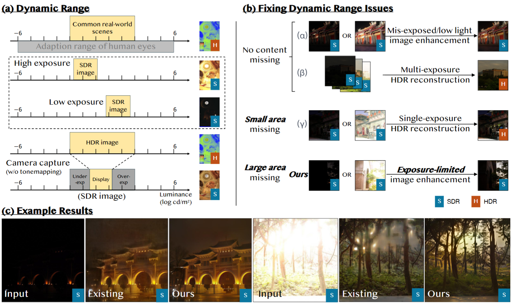
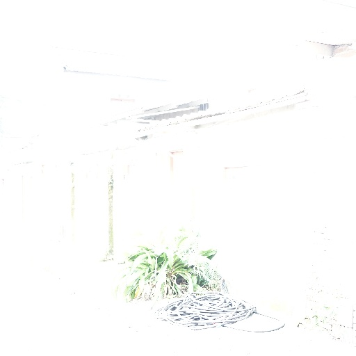

<!-- <p align="center">
    
</p> -->

## Low Dynamic Range Image Enhancement with Generative Diffusion Prior
[Paper]() | [Project Page](https://sagiri0208.github.io)

<!--  [](https://openxlab.org.cn/apps/detail/linxinqi/DiffBIR-official) [](https://colab.research.google.com/github/camenduru/DiffBIR-colab/blob/main/DiffBIR_colab.ipynb) -->

[Baiang Li](ztmotalee.github.io)<sup>1, 5</sup>, [Sizhuo Ma](https://sizhuoma.netlify.app/)<sup>2</sup>, [Yanhong Zeng](https://zengyh1900.github.io/)<sup>1</sup>, [Xiaogang Xu](https://xuxiaogang.com/)<sup>3, 4</sup>, [Youqing Fang]()<sup>1</sup>, [Zhao Zhang](https://sites.google.com/site/cszzhang)<sup>5</sup>, [Jian Wang](https://jianwang-cmu.github.io/)<sup>2\*</sup>, [Kai Chen](https://chenkai.site/)<sup>2\*</sup>

<sup>1</sup>Shanghai AI Laboratory<br><sup>2</sup>Snap Inc <br><sup>3</sup>The Chinese University of Hong Kong <br><sup>4</sup>Zhejiang University <br><sup>5</sup>Hefei University of Technology

<div align="center">
    <kbd></img></kbd>
</div>


## Our task:
<p align="center">
    
</p>

## :book:Table Of Contents

- [Visual Results](#visual_results)
- [Update](#update)
- [Installation](#installation)
- [Pretrained Models](#pretrained_models)
- [Inference](#inference)
- [Train](#train)

## <a name="visual_results"></a>Visual results on entire real-world image
<div style="display: flex; justify-content: space-around; align-items: flex-end;">
    <figure style="text-align: center;">
        
    </figure>
    <figure style="text-align: center;">
        
        <!-- <div style="text-align: center;">Medium: After previous methods</div> -->
    </figure>
    <figure style="text-align: center;">
        
        <!-- <div style="text-align: center;">Right: LS-Sagiri(Ours)</div> -->
    </figure>
</div>
Left: Input image; 
Medium: After previous methods; 
Right: LS-Sagiri(Ours)

## <a name="visual_results"></a>Visual results on selected region 
<div style="display: flex; justify-content: space-around;">
    <figure style="text-align: center;">
        
        <!-- <figcaption class="caption">Input</figcaption> -->
    </figure>
    <figure style="text-align: center;">
        
        <!-- <figcaption class="caption">Previous methods</figcaption> -->
    </figure>
    <figure style="text-align: center;">
        
        <!-- <figcaption class="caption">LS-Sagiri</figcaption> -->
    </figure>
</div>
Left: Input image; 
Medium: Previous methods; 
Right: LS-Sagiri(Ours)

## <a name="visual_results"></a>Sagiri plugged after other methods 
<div style="display: flex; justify-content: space-around;">
    <figure style="text-align: center;">
        
        <!-- <figcaption class="caption">Input</figcaption> -->
    </figure>
    <figure style="text-align: center;">
        
        <!-- <figcaption class="caption">SingleHDR</figcaption> -->
    </figure>
    <figure style="text-align: center;">
        
        <!-- <figcaption class="caption">SingleHDR+Sagiri</figcaption> -->
    </figure>
</div>
Left: Input image; 
Medium: SingleHDR; 
Right: SingleHDR+Sagiri(Ours)

<div style="display: flex; justify-content: space-around;">
    <figure style="text-align: center;">
        
        <!-- <figcaption class="caption">Input</figcaption> -->
    </figure>
    <figure style="text-align: center;">
        
        <!-- <figcaption class="caption">SingleHDR</figcaption> -->
    </figure>
    <figure style="text-align: center;">
        
        <!-- <figcaption class="caption">SingleHDR+Sagiri</figcaption> -->
    </figure>
</div>
Left: Input image; 
Medium: LCDPNet; 
Right: LCDPNet+Sagiri(Ours)

## <a name="visual_results"></a>Controlling where and what to generate
<div style="display: flex; justify-content: space-around; margin-top: 5px; margin-bottom: 5px;">    <figure style="text-align: center;">
        
    </figure>
    <figure style="text-align: center;">
        
    </figure>
    <figure style="text-align: center;">
        
    </figure>
    <figure style="text-align: center;">
        
    </figure>
</div>
<div style="display: flex; justify-content: space-around; margin-top: 5px; margin-bottom: 5px;">    <figure style="text-align: center;">
        
        <!-- <figcaption class="caption">Input</figcaption> -->
    </figure>
    <figure style="text-align: center;">
        
        <!-- <figcaption class="caption">SingleHDR</figcaption> -->
    </figure>
    <figure style="text-align: center;">
        
        <!-- <figcaption class="caption">+Sagiri(prompt a)</figcaption> -->
    </figure>
    <figure style="text-align: center;">
        
        <!-- <figcaption class="caption">+Sagiri(prompt b)</figcaption> -->
    </figure>
</div>
First: Input image;
Second: SingleHDR;
Third: SingleHDR+Sagiri (with prompt a);
Fourth: SingleHDR+Sagiri (with prompt b);<br>
Prompt a: ``A white waterfall is flowing down from the cliff, surrounded by rocks and trees.'';<br>
Prompt b: ``The sun is setting, and the sky is filled with clouds.''

## <a name="update"></a>Update

- **2024.06**: This repo is released.
<!-- - [**History Updates** >]() -->

## <a name="installation"></a>Start installation


```shell
# clone this repo
git clone https://github.com/openmmlab/Sagiri.git
cd Sagiri

# create an environment with python >= 3.9
conda create -n sagiri python=3.9
conda activate sagiri
pip install -r requirements.txt
```

## <a name="pretrained_models"></a>Pretrained Models

| Model Name | Description | HuggingFace | BaiduNetdisk | OpenXLab |
| :--------- | :---------- | :---------- | :---------- | :---------- |
| stage1.ckpt | Stage1 for brightness and color adjustment. | [download]() | [download](https://pan.baidu.com/s/1StNZdmnLx5uPsXIz-zXZSw?pwd=sgri )| [download]() |
| stage2.ckpt | Sagiri for conditional image generation. |[download]() | [download](https://pan.baidu.com/s/14bPVDza-gRbpF3qYeJuYHQ?pwd=sgri) | [download]() |
## <a name="inference"></a>Inference

### <a name="inference"></a>Stage 1 inference
Note that we can use other restoration models to finish stage 1's process.
```shell
python scripts/inference_stage1.py \
--config configs/model/swinir.yaml \
--ckpt /path/to/stage1/model \
--input /path/to/input/images \
--output /path/to/output/images
```
### <a name="inference"></a>Sagiri inference
```shell
python infer_Sagiri.py \
--config configs/model/cldm.yaml \
--ckpt  /path/to/stage2/model\
--steps 30 \
--input /path/to/input/images \
--output /path/to/output/images \
--disable_preprocess_model \
--device cuda
```

### <a name="inference"></a>LS-Sagiri inference
```shell
python infer_LSSagiri.py \
--config configs/model/cldm.yaml \
--ckpt  /path/to/stage2/model\
--steps 30 \
--input /path/to/input/images \
--output /path/to/output/images \
--device cuda
```

### <a name="train"></a>Start training
    ```shell
    python train.py --config [training_config_path]
    ```

For more training details, please refer to [DiffBIR](https://github.com/XPixelGroup/DiffBIR).

## Citation

Please cite us if our work is useful for your research.

```
@article{Li2024ldr,
  author    = {Baiang Li, Sizhuo Ma, Yanhong Zeng, Xiaogang Xu, Youqing Fang, Zhao Zhang, Jian Wang, Kai Chen},
  title     = {Low Dynamic Range Image Enhancement with Generative Diffusion Prior},
  journal   = {arxiv},
  year      = {2024},
}
```

## License

This project is released under the [Apache 2.0 license](LICENSE).

## Acknowledgement

This project is based on [ControlNet](https://github.com/lllyasviel/ControlNet), [BasicSR](https://github.com/XPixelGroup/BasicSR) and [DiffBIR](https://github.com/XPixelGroup/DiffBIR). Thanks for their awesome work.

## Contact

Should you have any questions, please feel free to contact with me at ztmotalee@gmail.com.
